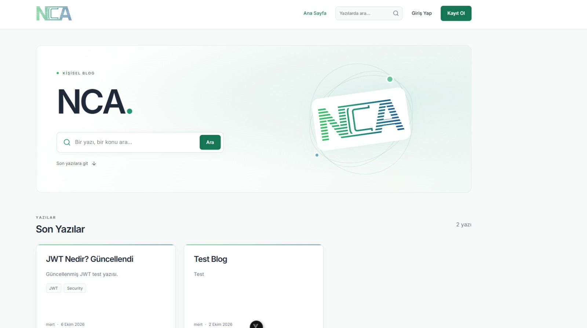
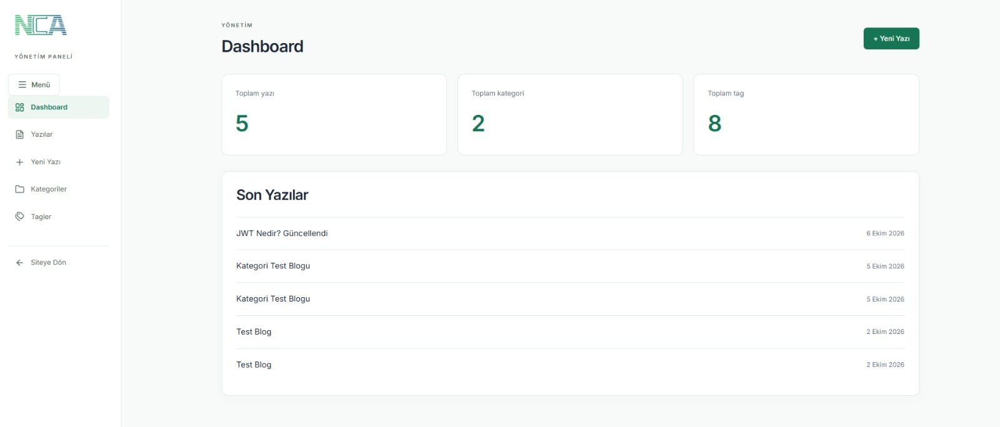
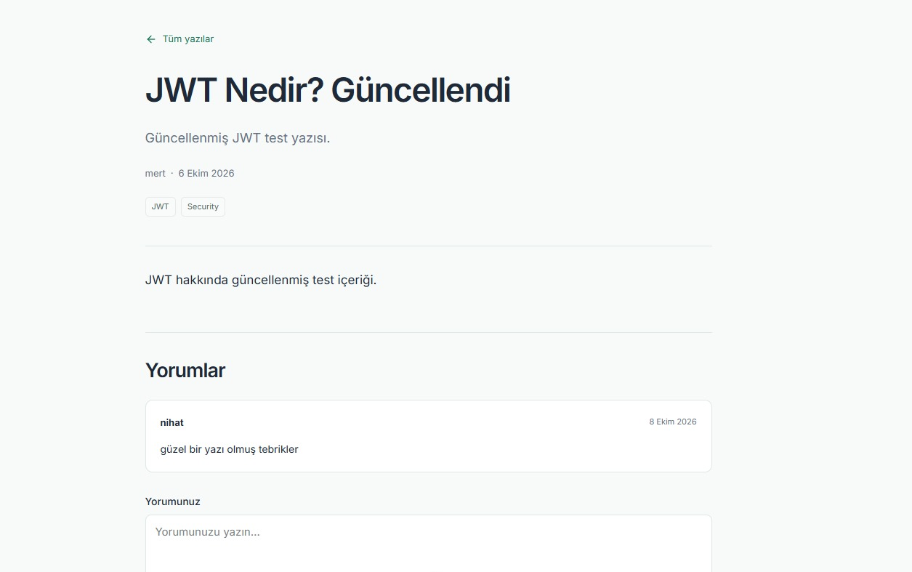

# NCA Blog

NCA Blog, **ASP.NET Core Web API**, **Vue 3** ve **PostgreSQL** kullanılarak geliştirilmiş full-stack bir kişisel blog uygulamasıdır.

Proje; kullanıcı kayıt/giriş sistemi, JWT authentication, refresh token, blog yazısı yönetimi, kategori-tag sistemi, yorumlar ve admin paneli içermektedir.

## Ekran Görüntüleri

### Ana Sayfa



### Yönetim Paneli



### Blog Yazısı ve Yorumlar



## Özellikler

- Kullanıcı kayıt ve giriş sistemi
- JWT Authentication
- Refresh Token Rotation
- User / Admin rol sistemi
- Blog yazısı oluşturma, düzenleme ve silme
- Yayınlama / taslak sistemi
- Kategori yönetimi
- Tag yönetimi
- Yorum sistemi
- Arama
- Pagination
- Admin paneli
- Global exception handling
- CORS
- Scalar API dokümantasyonu

## Kullanılan Teknolojiler

### Backend
- C#
- .NET 10
- ASP.NET Core Web API
- Entity Framework Core
- Npgsql
- JWT
- PostgreSQL

### Frontend
- Vue 3
- Vite
- Vue Router
- Pinia
- Axios
- JavaScript
- CSS

## Mimari

```text
Vue Frontend
     ↓
Axios
     ↓
ASP.NET Core Controller
     ↓
Service
     ↓
AppDbContext
     ↓
Entity Framework Core
     ↓
PostgreSQL
```

Backend tarafında **Controller - Service - DTO - Entity** yapısı kullanılmaktadır.

## Proje Yapısı

```text
NCA-Blog/
├── backend/
│   └── Blog.Api/
├── frontend/
│   └── Blog.Api.UI/
├── docs/
│   └── images/
└── README.md
```

## Kurulum

Repository'yi klonlayın:

```bash
git clone https://github.com/nihatakkaya/NCA-Blog.git
```

### Backend

```bash
cd backend/Blog.Api/Blog/BlogApi
dotnet restore
dotnet ef database update
dotnet run --launch-profile https
```

Backend:

```text
https://localhost:7226
```

Scalar:

```text
https://localhost:7226/scalar/v1
```

Connection String ve JWT bilgileri repository içerisinde tutulmamaktadır. ASP.NET Core User Secrets kullanılmalıdır.

### Frontend

```bash
cd frontend/Blog.Api.UI
npm install
npm run dev
```

`.env`:

```env
VITE_API_BASE_URL=https://localhost:7226/api
```

Frontend:

```text
http://localhost:5173
```

